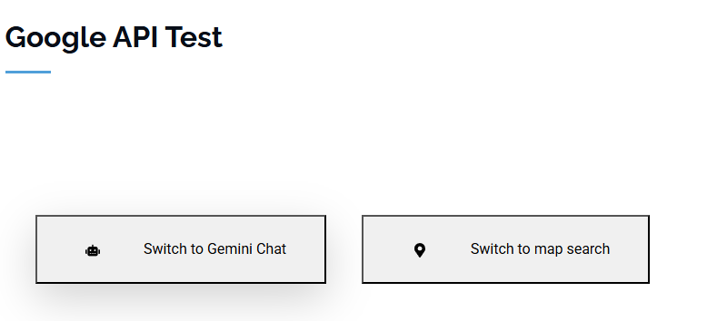
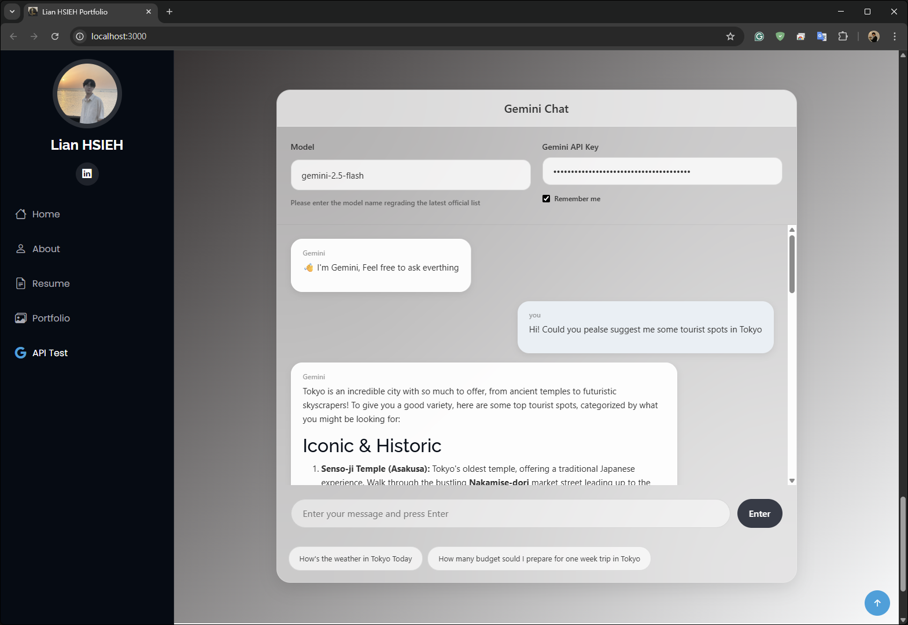
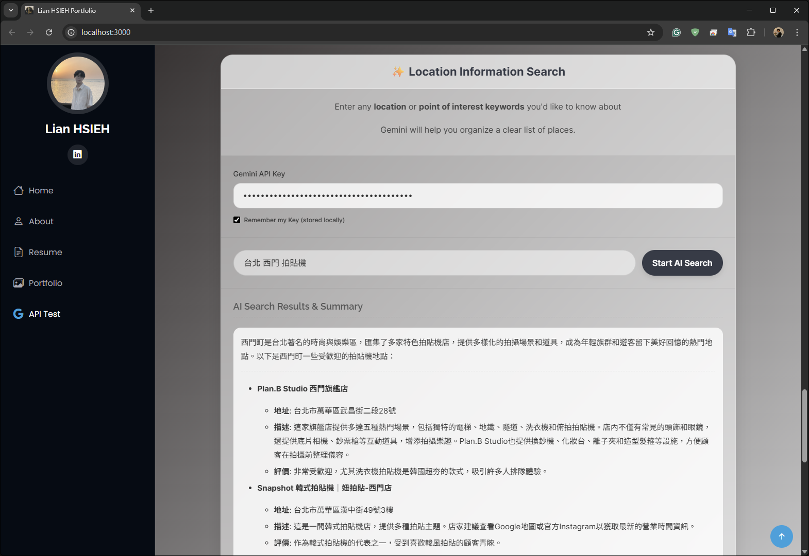

# ITTI_HW3 — React 前端 + Gemini 整合說明

本專案在一個 Bootstrap 主題的靜態網站中，插入一個 React 區塊，提供兩個功能：
- Gemini Chat 對話（`src/AItest.js`）
- 地點資訊搜尋（`src/map.js`，使用 Gemini 的 google_search 工具）

下文將解釋關鍵檔案之間如何串接，以及執行與展示方式。

---

## 專案簡介與功能說明

本專案結合既有的 `index.html`（個人作品集樣板）與一個嵌入式 React 應用：
- 透過上方切換按鈕在兩個功能間切換：
  - Chat：與 Gemini 對話（Markdown 輸出）。
  - Map Search：請 Gemini 先用 Google 搜尋，再整理地點清單（店名、地址、評分、摘要）。
- 兩個功能共用同一把 Gemini API Key，儲存在瀏覽器 `localStorage`（僅本機）。
- 目標是「用 AI 幫忙找與整理資訊」，因此不直接載入 Google Maps/Places SDK，也不渲染地圖。

---

## 專案執行

```bash
npm install
npm start
```

啟動後開啟 `http://localhost:3000`。主頁為 `public/index.html`（Bootstrap 作品集主題），React 應用會掛載在頁面中的 `#react-root` 區塊。

---

## 使用的 API 與能力

- Gemini Generative Language API
  - Endpoint：`models/{model}:generateContent`
  - 在 `AItest` 中用於一般對話；在 `map` 中搭配工具使用。
  - 權杖：以使用者輸入的 API Key 透過查詢參數 `?key=...` 傳遞。
- Google Search Tool（透過 Gemini 工具機制）
  - 在 `map.js` 的請求 payload 中以 `tools: [{ google_search: {} }]` 啟用。
  - 讓模型先檢索最新公開資料，再生成整理後的 Markdown 清單。

安全性注意：本專案為教學/展示用途，API Key 儲存在前端 `localStorage`。正式環境建議改由後端代理請求以保護金鑰。

---

## 檔案關聯與職責

### [`public/index.html`](public/index.html)
- 靜態外殼與版型（Bootstrap、AOS、Swiper 等資源）。
- 在「Gemini API Test」段落內放置 React 掛載點：

```432:434:public/index.html
<div id = "react-root" style="margin-top:20px;"></div>
```

### [`src/index.js`](src/index.js)
- 將 React App 掛載到 `#react-root`，只控制該區塊而不影響整個靜態模板。

```6:8:src/index.js
const el = document.getElementById('react-root');
if (el) {
  createRoot(el).render(<App />);
}
```

> 若要啟用全域樣式，建議在此檔案加入 `import './index.css';`。

### [`src/App.js`](src/App.js)
- React 區塊的主入口，提供兩顆按鈕在兩個功能間切換：
  - `AItest`：Gemini 對話
  - `GoogleMapsSearch`：地點資訊搜尋
<br><br><br><br>
- 用一個 `activeView` 狀態記錄目前顯示哪個頁面，並透過 `renderView()` 決定要渲染哪個元件。


```12:23:src/App.js
const [activeView, setActiveView] = useState('AI');
const renderView = () => {
  switch (activeView) {
    case 'AI':
      return <AItest />;
    case 'Map':
      return <GoogleMapsSearch />;
    default:
      return <p className="text-center text-gray-500 p-8">請選擇一個頁面</p>;
  }
};
```  


### [`src/AItest.js`](src/AItest.js)（Gemini Chat）
- 提供聊天介面：輸入訊息 → 呼叫 Gemini `generateContent` → 以 Markdown 顯示回覆。
- 從 `localStorage` 讀寫 `gemini_api_key`，方便使用者重用金鑰（僅儲存在本機）。
<br><br><br><br>
- 關鍵呼叫流程：

```69:93:src/AItest.js
const apiUrl = `${GEMINI_API_BASE_URL}${modelId}:generateContent?key=${apiKey}`;
const payload = { contents: newHistory };
const response = await fetch(apiUrl, {
  method: 'POST',
  headers: { 'Content-Type': 'application/json' },
  body: JSON.stringify(payload),
});
```

### [`src/map.js`](src/map.js)（地點資訊搜尋）
- 讓 AI 扮演「地點搜尋助理」，並啟用 `google_search` 工具先上網查最新資料，再以 Markdown 清單回覆。
- 只有文字與清單呈現，沒有地圖渲染；因此不需載入 Google Maps/Places SDK。
<br><br><br><br>
- 指數退避重試（處理 429/5xx）：

```72:89:src/map.js
for (let attempt = 0; attempt < maxRetries; attempt++) {
  response = await fetch(apiUrl, { method:'POST', headers:{ 'Content-Type':'application/json' }, body: JSON.stringify(payload) });
  if (response.ok) break;
  if (attempt < maxRetries - 1 && (response.status === 429 || response.status >= 500)) {
    const delay = Math.pow(2, attempt) * 1000 + Math.random() * 1000;
    await new Promise(resolve => setTimeout(resolve, delay));
  } else {
    const errorBody = await response.json().catch(() => ({}));
    const errorDetail = errorBody?.error?.message || `HTTP Error! Status code: ${response.status}`;
    throw new Error(`API request failed: ${errorDetail}`);
  }
}
```

---

## 使用方式（Demo 流程）
1. 滑動至「API Test」區塊（頁面底部）。
2. 在 React 區塊上方的按鈕選擇功能：聊天或地點搜尋。
3. 先在任一功能輸入你的 Gemini API Key（可勾選 Remember，金鑰將儲存在本機瀏覽器）。
4. 聊天：輸入訊息送出；結果以 Markdown 呈現。
5. 地點搜尋：輸入如「台北 不限時 咖啡廳」，送出；稍待 AI 整理並顯示清單。

---

## 安裝與執行方式

環境需求：Node.js 18+ 建議。

1) 安裝依賴
```bash
npm install
```

2) 啟動開發伺服器
```bash
npm start
```

3) 瀏覽與操作
- 瀏覽器開啟 `http://localhost:3000`
- 移至頁面中的「Google API Test」段落（含 `#react-root`）
- 依「使用方式（Demo 流程）」進行測試

4) 建置（可選）
```bash
npm run build
```
會輸出至 `build/` 目錄，供靜態託管。

---

## 呈現樣貌（預期畫面）
- 上方有兩顆切換按鈕：Gemini Chat 與 Map Search。
- 中央白色卡片為 React 內容區：
  - Chat：對話泡泡、輸入框、送出按鈕與載入提示。
  - Map Search：API Key 區、查詢輸入框、載入中的轉圈圈、Markdown 清單結果。
- 外層仍是 Bootstrap 主題（個人作品集頁面）。

---

## 注意事項
- 金鑰只儲存在瀏覽器的 `localStorage`（demo 用法）。生產環境建議改由後端代理以保護金鑰。
- 若要讓 `src/index.css` 的全域樣式生效，請在 `src/index.js` 加入 `import './index.css';`。

